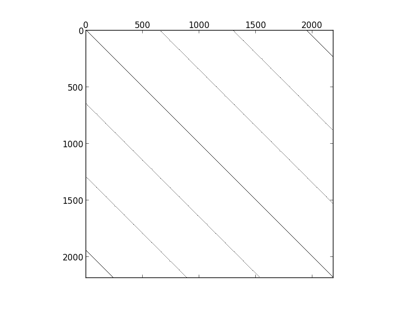
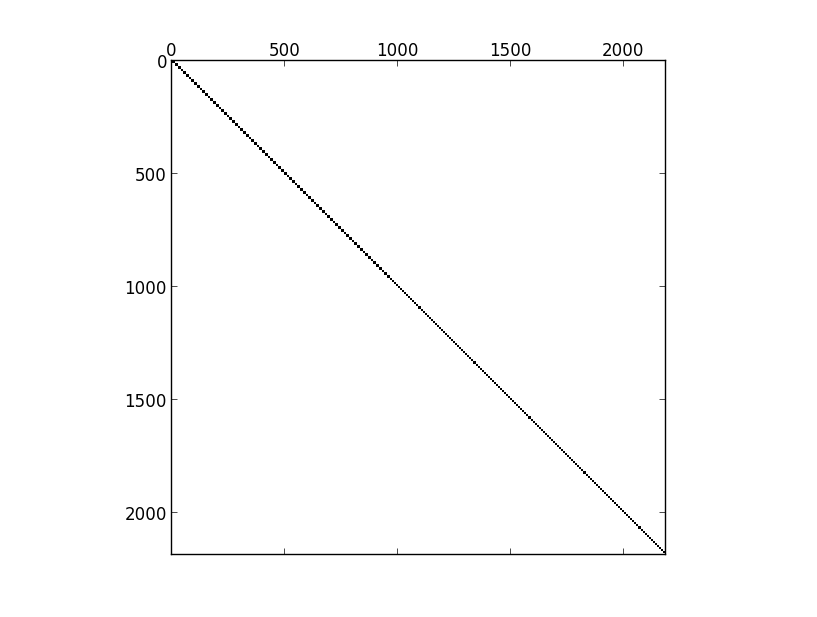

Overview
=========

Out of personal curiosity and interest I am writing a solver for the
incompressible Navier-Stokes equations on a fully
periodic domain. This repository contains my current progress.
This project is experimental and in "research" mode. I don't know
if it will work, and the code is in a very early stage.


Details
-------
I start with a standard tensor-product Fourier basis
for each component of the fluid velocity, and I furthermore
combine this with a Galerkin approximation approach. Ideally
this should yield an exponential convergence rate and therefore
minimize memory requirements to simulate fine scale behavior;
however, handling pressure is tricky. Therefore to make
this a little easier I simply take the curl of the tensor-product
basis, this forces the basis to be divergence-free and eliminates
the pressure term. The curl-tensor-product basis yields a set
of functions which is highly linearly dependent, and so 
my initial fix to this was simply to use a rank-revealing QR
factorization supplied by Julia's "qrfact" function and then
extract the permutation vector. This yields both the numerical rank
of the basis as well as a reasonable set of basis functions to throw out
as redundant. That approach however severely limits the order I can use
because qrfact must be used on a dense matrix, and the dimensions
grow rapidly, quickly swamping out memory. What I am currently
attempting to do now is to detect the rank of the matrix while 
using the fact that the curl-tensor-product basis yields a very 
sparse mass matrix, allowing me to scale the approach to much
higher orders.

So far the Galerkin inner products are partially computed analytically
and partially computed through the Trapezoid rule, which is a rapidly
convergent quadrature rule for smooth periodic functions. Early
simulations simply construct the dense interpolation matrices
explicitly so as to make use of all cores through OpenBLAS. Later
work can use more efficient analytical formulas and some
threading model to utilize all cores.

May 6th, 2015: Managing Linear Dependence
-----------
I have discovered a way that may allow me to reject dedundant
functions from my curl-tensor-product set without computing
a very large and dense rank-revealing QR factorization. The observation
comes from the fact that if a matrix is block diagonal, then the rank of that 
matrix is equal to the sum of the ranks of its blocks. I have discovered a simple
permutation of the curl-tensor-product-fourier basis which puts its
mass matrix into block diagonal form with very small blocks - and 
these can be processed in parallel. It works by finding the
row pointers of the entries of the columns of the sparse matrix
and then sorting the columns lexicographically. The Julia 
code for achieving this is

```julia
function sparse_reorder(A)
    (m,n)=size(A);
    U=Array(Array{Int64},(m,));
    for i=1:m
        U[i]=A.rowval[A.colptr[i]:A.colptr[i+1]-1];
    end
    p=sortperm(U,lt=lexless);
    return p;
end

```

I tested this on a few normal sparse matrices and it doesn't have a very useful
effect (one could for example use a reverse cuthill-mckeee reordering to achieve
much more significant blocking). However on the curl-tensor-product-fourier basis 
mass matrix it yields exactly a block diagonal sparse matrix. As an example
consider an order 6 mass matrix with sparsity pattern as follows


which can be generated by the code

```julia
include("incompressible_basis.jl");
using PyPlot;

order=6;
M=curl_basis_mass_matrix(order);
spy(M);
```

and then the "reordered" version of this matrix which perfectly captures the block
structure:




which can be generated with the following code:

```julia
include("incompressible_basis.jl");
include("sparse_reorder.jl");
using PyPlot;

order=6;
M=curl_basis_mass_matrix(order);
p=sparse_reorder(M);
spy(M[p,p]);
```


now computing the RRQR factorization of this matrix can proceed by performing
very small RRQR of its blocks in parallel, a significantly more scalable operation
than treating the large sparse matrix as if it were dense. I have yet to write the code
to perform that, but it is my next step. This removes the bottleneck of a massive
dense linear algebra in producing a divergence-free basis that automagically
eliminates the pressure term from the Navier-Stokes equation, but computing
the mass matrix at high orders also has proven to be challenging and so I will
need to address this as well. Early profiling suggests that the function
which accepts a linear index and translates it into 3D indexing is a 
huge bottleneck for this.


